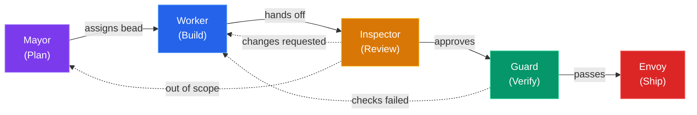

# OpenCode Village

## Orchestrating AI Agents for Software Development

<div class="mt-8 text-lg" style="color: var(--vivid-muted)">
Role-separated, bead-tracked, skill-driven AI workflow
</div>

<div class="abs-bl m-6 text-sm" style="color: var(--vivid-comment)">
Oleksandr Ovcharov &bull; April 2026
</div>

<!--
Speaker notes:

Back in February I started thinking about how we use AI coding
assistants. The agent writes code,
runs tests, pushes to production. And it works great... until it
doesn't.

The big insparation behind this was Steve Yegge's "Gas Town".
I really liekd the idea but I found it too bulky to actually run it locally.

So what I built here is much more lighter orchestration workflow. Let me show you
what came out of it.
-->

---
layout: default
---

# The Problem

<h3 style="color: var(--vivid-orange); font-weight: 400; margin-bottom: 1.5em;">
What happens when one AI agent does everything?
</h3>

<v-clicks>

- **No separation of concerns** — the same agent edits code, runs tests, and pushes to production
- **No accountability** — when something breaks, there's no audit trail of *who* decided *what*
- **Context death** — session compaction erases memory; the AI forgets yesterday's decisions
- **Unchecked scope creep** — without guardrails, the agent "helpfully" rewrites your entire codebase
- **Trust is binary** — you either give it full access or none at all

</v-clicks>

<!--
Speaker notes:

If you've used Copilot, Cursor, or any AI coding assistant in a long session,
you know the feeling. *click* It starts great, *click* then context degrades,
*click* it loses track of what it already did, *click* and you end up
babysitting it anyway. *click*

The core issue: a single agent with full permissions and no memory is a recipe
for unpredictable behaviour. We need structure.
-->

---
layout: center
class: text-center
---

# What if your AI assistant had coworkers?

<div class="mt-6 text-xl" style="color: var(--vivid-purple)">
A team of specialists — each with a clear role, strict permissions, and a shared task board.
</div>

<div class="mt-12 text-6xl">
<span style="color: var(--vivid-cyan)">&#x1f3d8;</span>
</div>

<div class="mt-4 text-lg" style="color: var(--vivid-muted)">
Welcome to the Village.
</div>

<!--
Speaker notes:

Instead of one omnipotent agent, imagine five:
one that plans, one that codes, one that reviews, one that tests, and one that ships.

Each has hard limits on what it can do. They communicate through a shared
issue tracker (beads), and hand off work to each other.
-->

---
transition: slide-left
---

# The Village Model

<h3 style="color: var(--vivid-orange); font-weight: 400; margin-bottom: 0.8em;">
Separation of concerns via permissions — just like a real team.
</h3>



<div class="grid grid-cols-5 gap-3 mt-2 text-center text-xs">
<div><span style="color: var(--vivid-purple); font-weight: 700;">Mayor</span><br/><span style="color: var(--vivid-muted);">Plans & creates beads</span></div>
<div><span style="color: var(--vivid-blue); font-weight: 700;">Worker</span><br/><span style="color: var(--vivid-muted);">Edits code & commits</span></div>
<div><span style="color: var(--vivid-orange); font-weight: 700;">Inspector</span><br/><span style="color: var(--vivid-muted);">Read-only code review</span></div>
<div><span style="color: var(--vivid-green); font-weight: 700;">Guard</span><br/><span style="color: var(--vivid-muted);">Runs lint, test, build</span></div>
<div><span style="color: var(--vivid-red); font-weight: 700;">Envoy</span><br/><span style="color: var(--vivid-muted);">Pushes & opens PRs</span></div>
</div>

<div class="mt-4 text-sm" style="color: var(--vivid-muted)">
Each agent can <strong style="color: var(--vivid-yellow);">only</strong> do what its role allows. Workers can't push, inspectors can't edit, guards can't write code — natural checks and balances.
</div>

<!--
Each agent can only do what its role allows. Workers can't push, inspectors can't edit, guards can't write code. This creates natural checks and balances — just like a well-run engineering team.
-->

---
transition: slide-left
---

# Permission Matrix

What each agent **can** and **can't** do:

<div class="mt-4">

| Capability | <span style="color: var(--vivid-purple)">Mayor</span> | <span style="color: var(--vivid-blue)">Worker</span> | <span style="color: var(--vivid-orange)">Inspector</span> | <span style="color: var(--vivid-green)">Guard</span> | <span style="color: var(--vivid-red)">Envoy</span> |
|:-----------|:-----:|:------:|:---------:|:-----:|:-----:|
| Read code | ✅ | ✅ | ✅ | ✅ | ✅ |
| Edit files | ❌ | ✅ | ❌ | ❌ | ❌ |
| Local commits | ❌ | ✅ | ❌ | ❌ | ❌ |
| Run tests / lint | ❌ | ❌ | ❌ | ✅ | ❌ |
| Git push | ❌ | ❌ | ❌ | ❌ | ✅ |
| Create beads | ✅ | ❌ | ❌ | ❌ | ❌ |
| Open PRs | ❌ | ❌ | ❌ | ❌ | ✅ |

</div>

<div class="mt-6 text-sm" style="color: var(--vivid-muted)">
  Permissions are enforced by agent system prompts — not trust, but design.
</div>

<!--
Speaker notes:

So let's just quickly go through the matrix. Each column shows
what an agent can and can't do. The worker can edit files and commit,
but can't push. The inspector can review, but can't change anything.
The guard runs tests, but can't write code. And only the envoy can
push to the remote.

It's all enforced by their system prompts — not by trust, but by design.
-->

---
transition: slide-left
---

# <span style="color: var(--vivid-purple)">Mayor</span> — The Planner

<div class="grid grid-cols-[1fr_1fr] gap-6">
<div>

<v-clicks>

- **Researches** scope, asks clarifying questions, drafts the plan
- **Creates epics + child beads** — every task gets: Context, Skills, Branch, AC
- **Read-only** — never modifies files or runs commands
- **Beads are created immediately** — no waiting for approval gates
- **Sets the `## Skills`** section so workers load the right expertise

</v-clicks>

</div>
<div>


</div>
</div>

<div class="mt-4 text-sm" style="color: var(--vivid-muted)">
<code>/village:work</code> &rarr; mayor researches &rarr; <code>br create</code> &rarr; beads assigned to worker
</div>

<!--
Speaker notes:

A little bit about agents I use.

The Mayor is your project manager. *click* It takes a high-level goal
("add dark mode support") and breaks it into concrete, implementable
beads *click* with clear acceptance criteria.

Key design choice: *click* the Mayor CAN'T edit files. This prevents
the planner from "just doing it" and skipping the review pipeline.
*click* It must delegate.

Every bead the Mayor creates includes a Skills section *click* — this
tells the Worker which domain skills to load (e.g. stack-typescript, stack-go, stack-rust, stack-ruby-on-rails). 
This is how the village stays polymorphic across tech stacks.
-->

---
transition: slide-left
---

# <span style="color: var(--vivid-blue)">Worker</span> — The Implementer

<div class="grid grid-cols-[1fr_1fr] gap-6">
<div>

<v-clicks>

- **Implements exactly what the bead asks** — no more, no less
- **Claims work via `village_claim`** — single in-progress guard enforced
- **Commits locally** on `epic/*` branches — cannot push
- **Loads skills** from the bead's `## Skills` section before coding
- **Hands off to Inspector** when implementation is complete

</v-clicks>

</div>
<div>


</div>
</div>

<div class="mt-4 text-sm" style="color: var(--vivid-muted)">
<code>village_claim</code> &rarr; implement &rarr; <code>git commit</code> &rarr; handoff to inspector
</div>

<!--
Speaker notes:

The Worker is the only agent that can edit files *click* and make git
commits. But it can't push *click* — that's the Envoy's job.

There's one important rule: *click* the Worker can only work on one
thing at a time. It has to finish what it's doing — or flag it as
blocked — before picking up the next task.

Skills are loaded dynamically: *click* a Rails bead loads
stack-ruby-on-rails, a TypeScript bead loads stack-typescript.
Same worker, different expertise. *click* This is the "polymorphic
via skills" pattern.
-->

---
transition: slide-left
---

# <span style="color: var(--vivid-orange)">Inspector</span> — The Reviewer

<div class="grid grid-cols-[1fr_1fr] gap-6">
<div>

<v-clicks>

- **Read-only code review** — cannot edit any files
- **Judgment checklist:** AC coverage, diff scope, regression sniff
- **Three verdicts:**
  - Approve &rarr; Guard
  - Changes requested &rarr; Worker
  - Out of scope &rarr; Mayor
- **Catches issues** before expensive CI runs
- **Writes review notes** as bead comments for traceability

</v-clicks>

</div>
<div>


</div>
</div>

<div class="mt-4 text-sm" style="color: var(--vivid-muted)">
Approve &rarr; guard &nbsp;|&nbsp; Changes requested &rarr; worker &nbsp;|&nbsp; Out of scope &rarr; mayor
</div>

<!--
Speaker notes:

The Inspector is intentionally read-only. *click* It can't "just fix"
an issue — it must send the bead back to the Worker *click* with clear
feedback.

This mirrors how human code review works: *click* the reviewer doesn't
commit to your branch. They leave comments and you address them.

Why inspect before running tests? *click* Because CI is expensive (time
and compute). Catching a misunderstood AC or a scope violation before
tests run saves cycles. *click* The Inspector is the human-like judgment
layer; the Guard is the mechanical one.
-->

---
transition: slide-left
---

# <span style="color: var(--vivid-green)">Guard</span> — The Verifier

<div class="grid grid-cols-[1fr_1fr] gap-6">
<div>

<v-clicks>

- **Runs the mechanical check matrix:** lint, typecheck, test, build
- **Polymorphic via stack skills** — same Guard, different checks per project
- **All green &rarr; closes the bead;** any red &rarr; returns to Worker
- **Cascade-closes** parent epic when all child beads pass
- **Reports the full matrix** — all checks run even if one fails early

</v-clicks>

</div>
<div>


</div>
</div>

<div class="mt-4 text-sm" style="color: var(--vivid-muted)">
<code>lint</code> &rarr; <code>typecheck</code> &rarr; <code>test</code> &rarr; <code>build</code> &rarr; all green? &rarr; <code>br close</code>
</div>

<!--
Speaker notes:

The Guard itself is pure automation *click*.
It loads the same stack skill as the Worker *click* 
and runs every check defined by stack.

*click* One key rule is that Guard run ALL checks even if one fails. This gives the Worker
a complete picture on the first bounce-back, *click* instead of playing
whack-a-mole with one error at a time.

When the Guard closes the last child bead of an epic, *click* it
automatically cascade-closes the parent. No human intervention needed.
-->

---
transition: slide-left
---

# <span style="color: var(--vivid-red)">Envoy</span> — The Diplomat

<div class="grid grid-cols-[1fr_1fr] gap-6">
<div>

<v-clicks>

- **Optional, human-triggered only** — invoked via `/village:envoy`
- **Pushes branches** and **opens GitHub PRs**
- **Cannot force push** or create non-`epic/*` branches
- **Minimal PR template:** What changed, Why, Closes `#issue`
- **Terminal step** — the only agent that touches the remote

</v-clicks>

</div>
<div>


</div>
</div>

<div class="mt-4 text-sm" style="color: var(--vivid-muted)">
Human triggers <code>/village:envoy</code> &rarr; push &rarr; <code>gh pr create</code> &rarr; done
</div>

<!--
Speaker notes:

The Envoy is deliberately the ONLY agent that can interact with the
remote. *click* And it's human-triggered — it won't auto-ship code.

*click* Everything up to the Envoy is local.
You can review all the commits, *click* all the bead history, before
deciding to ship.

The Envoy's PR template is intentionally minimal: *click* What, Why,
Closes. No boilerplate, no checklist — that was already handled by the
Inspector and Guard.

The reason the Envoy exists as a separate agent *click* is so that
shipping is always a conscious, human-initiated decision. You're never
surprised by code appearing on the remote.
-->

---
transition: slide-left
---

# What Are <span style="color: var(--vivid-green)">Beads</span>?

<div class="grid grid-cols-[1fr_1fr] gap-6">
<div>

<v-clicks>

- **Git-native, AI-first issue tracker** — issues live inside the repo in `.beads/`
- **SQLite locally**, synced to JSONL for git versioning — no external API needed
- **Issue types:** task, bug, feature, epic, chore, decision, question, docs
- **Priority levels:** P0 (critical) &rarr; P4 (backlog)
- **Rich dependencies:** blocks, parent-child, discovered-from
- **Issues travel with the code** — clone the repo, get the full project history

</v-clicks>

</div>
<div>

```bash
# Create a task
br create --title="Add auth middleware" \
  --type=task --priority=2

# See what's ready to work on
br ready

# Show details
br show bd-42

# Close when done
br close bd-42 --reason="Implemented"
```

</div>
</div>

<div class="mt-4 text-sm" style="color: var(--vivid-muted)">
<code>.beads/</code> &rarr; SQLite + JSONL &rarr; <code>git add .beads/ && git commit</code> &rarr; issues travel with every clone
</div>

<!--
Speaker notes:

By this time I already mentioned beads quite a few times.
A "bead" is the shared task list makes the whole village work. *click*
Without it, the agents would need something external like Jira or
Linear to keep track of what needs doing.

The cool part is that issues live right inside your repo. *click* You
clone the project, you get the issues. Simple as that.

Under the hood it's a SQLite database for speed, *click* with a text
export so git can track changes. You don't really need to think about
that — it just works.

The dependency system is what makes the workflow smooth: *click* when
one task depends on another, the agents automatically know to work on
the unblocked ones first. *click* 
that can't be started yet.

*click* I personally don't commit beads and keep them local, but you can do that if you want.
-->

---
transition: slide-left
---

# <span style="color: var(--vivid-cyan)">Context Preservation</span> — br prime

<div class="grid grid-cols-[1fr_1fr] gap-6">
<div>

<v-clicks>

- **The problem:** AI sessions have limited context windows — *compaction kills memory*
- **`br prime`** outputs an AI-optimised summary of all beads state
- **Auto-injected** by the opencode-beads-rust plugin on session start **and** after compaction
- **This is the "memory"** that ties agents across sessions together
- **Discovery chains:** agent finds bug while working on feature &rarr; links with `discovered-from` &rarr; future agents see the full context

</v-clicks>

</div>
<div>

```bash
# What br prime outputs:
$ br prime

# ── Active Beads ──
# bd-139 [epic] P1 open
#   Build OpenCode Village Presentation
#
# bd-139.5 [task] P1 in_progress
#   Beads + Context Preservation slides
#   blocked-by: bd-139.4 (closed ✓)
#   blocks: bd-139.6
#
# ── Summary ──
# 3 open | 4 closed | 1 in_progress
```

</div>
</div>

<div class="mt-4 text-sm" style="color: var(--vivid-muted)">
Session starts &rarr; <code>br prime</code> auto-injected &rarr; agent has full project memory &rarr; compaction happens &rarr; <code>br prime</code> re-injected
</div>

<!--
Speaker notes:

This is arguably the most important slide. *click* It answers the
question: "How do different AI sessions share knowledge?"

Without br prime, *click* every new session starts from zero. The agent
has to re-discover what's been done, what's blocked, what's in progress.

With br prime, *click* the first thing the agent sees is a structured
summary of all beads — priorities, statuses, dependencies, and discovery
chains.

The discovery chain feature is especially powerful. *click* Say a Worker
is implementing a feature and discovers a bug. It creates a new bead
with discovered-from linking back to the original feature bead. When a
future agent runs br prime, it sees that relationship and understands
WHY that bug bead exists.

The plugin handles injection automatically *click* — you don't need to
remember to run br prime manually. It just works.
-->

---
transition: slide-left
---

# <span style="color: var(--vivid-green)">beads_viewer</span> (bv) — Interactive TUI

<div class="grid grid-cols-[1fr_1fr] gap-6">
<div>

<v-clicks>

- **Terminal UI** for browsing issues interactively
- **Board view** — see all issues by status at a glance
- **Dependency graph** — visualise which issues block which
- **Agents use `br` CLI** with `--json` for structured data
- **Humans use `bv`** for visual exploration and triage
- **Same data, different interface** — SQLite underneath both

</v-clicks>

</div>
<div>


</div>
</div>

<div class="mt-4 text-sm" style="color: var(--vivid-muted)">
Agents: <code>br show bd-42 --json</code> &nbsp;|&nbsp; Humans: <code>bv</code> &rarr; interactive board &amp; graph
</div>

<!--
Speaker notes:

I also use `beads_viewer` is the human-friendly interface to the same data. *click*
While agents interact with beads through the br CLI *click*, humans get a full terminal UI.

The board view *click* shows issues grouped by status — open,
in_progress, blocked, closed. *click* You can filter by type, priority, or
assignee.

*click* Agents and people work with the same underlying
data. There's no sync problem, no "source of truth" debate. *click*
It's all in beads.
-->

---
transition: slide-left
---

# <span style="color: var(--vivid-yellow)">Slash Commands</span>

<div class="grid grid-cols-[1fr_1fr] gap-6">
<div>

<v-clicks>

- **`/village:work`** — The main loop: claim bead &rarr; load skills &rarr; implement &rarr; handoff &rarr; repeat
- **`/village:board`** — ASCII board of current village state: who has what bead, what status
- **`/village:orphans [fix]`** — Find unassigned beads; pass `fix` to auto-assign them
- **`/village:envoy <id>`** — Dispatch the Envoy to push branch and open a GitHub PR

</v-clicks>

</div>
<div>

```bash
# Start the work loop (as any role)
/village:work

# See the board at a glance
/village:board
# ┌─────────┬──────────┬──────────┐
# │  open   │ progress │  closed  │
# ├─────────┼──────────┼──────────┤
# │ bd-42   │ bd-41    │ bd-40 ✓  │
# │ bd-43   │          │ bd-39 ✓  │
# └─────────┴──────────┴──────────┘

# Find & fix orphaned beads
/village:orphans fix

# Ship it
/village:envoy bd-41
```

</div>
</div>

<div class="mt-4 text-sm" style="color: var(--vivid-muted)">
Four commands. Each role runs <code>/village:work</code> — the command adapts to the agent's permissions.
</div>

<!--
Speaker notes:

There are only four slash commands to learn.

`/village:work` *click* is the workhorse. You would use it to run the agents. 
When the Worker runs it, it implements. When the Guard runs it, it runs checks. 
The command adapts to the agent's permission set.

`/village:board` *click* gives you a quick overview without leaving your
terminal. It's like a mini kanban board showing who has what.

*click* Sometimes beads get created but not assigned. `/village:orphans` this finds 
them and  fixes the assignment.

`/village:envoy` *click* is the human-triggered shipping step. You decide
when to push. The Envoy handles the rest.
-->

---
transition: slide-left
---

# <span style="color: var(--vivid-cyan)">Workflow Walkthrough</span> — Idea to PR

<h3 style="color: var(--vivid-orange); font-weight: 400; margin-bottom: 0.6em;">
Every role runs <code>/village:work</code> — the command adapts to the agent's permissions.
</h3>

<div class="grid grid-cols-[auto_1fr] gap-x-4 gap-y-2 mt-2 text-sm">

<div style="color: var(--vivid-purple); font-weight: 700; white-space: nowrap;">① Plan</div>
<div>User tells Mayor <em>"Add dark mode"</em> → Mayor creates epic + 3 child beads with AC & skills</div>

<div style="color: var(--vivid-blue); font-weight: 700; white-space: nowrap;">② Build</div>
<div>Worker runs <code>/village:work</code> → <code>village_claim</code> picks bd-42 → loads <code>stack-typescript</code> → implements → <code>git commit</code> → hands off to Inspector</div>

<div style="color: var(--vivid-orange); font-weight: 700; white-space: nowrap;">③ Review</div>
<div>Inspector runs <code>/village:work</code> → claims bd-42 → checks AC coverage, diff scope, regression sniff → approves → hands off to Guard</div>

<div style="color: var(--vivid-green); font-weight: 700; white-space: nowrap;">④ Verify</div>
<div>Guard runs <code>/village:work</code> → claims bd-42 → runs <code>lint</code> → <code>typecheck</code> → <code>test</code> → <code>build</code> → all green → <code>br close bd-42</code></div>

<div style="color: var(--vivid-muted); font-weight: 700; white-space: nowrap;">⟳ Repeat</div>
<div style="color: var(--vivid-muted);">Steps ②–④ for each child bead (bd-43, bd-44…) until the epic is complete</div>

<div style="color: var(--vivid-red); font-weight: 700; white-space: nowrap;">⑤ Ship</div>
<div>User triggers <code>/village:envoy</code> → Envoy pushes branch → <code>gh pr create</code> → PR #123 opened</div>

</div>

<div class="mt-4 text-sm" style="color: var(--vivid-muted)">
One idea → structured beads → implemented → reviewed → verified → shipped. No step skipped, no single agent handles the full lifecycle.
</div>

<!--
Speaker notes:

This is the complete lifecycle in action.

The user only needs one command: /village:work. It adapts to whichever
agent is running. Mayor plans, Worker builds, Inspector reviews, Guard verifies.

The key is the sequential handoff - no agent can skip a step.
Steps 2-4 repeat for each child bead. When the Guard closes the last
child, it cascade-closes the parent epic.

Step 5 is human-triggered: you decide when to ship. The Envoy handles
the mechanics. You can also ask Envoy to publish something or anything production related.
Note, that Envay is banned from force pushing.
-->

---
transition: slide-left
---

# Success: <span style="color: var(--vivid-green)">Vibecoding Go</span> Without Knowing Go

<div class="grid grid-cols-4 gap-4 my-6 text-center">
<div style="border: 1px solid var(--vivid-green); border-radius: 12px; padding: 1.2em 0.5em;">
<div style="font-size: 2.4em; font-weight: 800; color: var(--vivid-green); line-height: 1;">22</div>
<div style="color: var(--vivid-muted); font-size: 0.85em; margin-top: 0.3em;">Merged PRs</div>
</div>
<div style="border: 1px solid var(--vivid-blue); border-radius: 12px; padding: 1.2em 0.5em;">
<div style="font-size: 2.4em; font-weight: 800; color: var(--vivid-blue); line-height: 1;">3</div>
<div style="color: var(--vivid-muted); font-size: 0.85em; margin-top: 0.3em;">Go Repositories</div>
</div>
<div style="border: 1px solid var(--vivid-orange); border-radius: 12px; padding: 1.2em 0.5em;">
<div style="font-size: 2.4em; font-weight: 800; color: var(--vivid-orange); line-height: 1;">~4</div>
<div style="color: var(--vivid-muted); font-size: 0.85em; margin-top: 0.3em;">Weeks</div>
</div>
<div style="border: 1px solid var(--vivid-red); border-radius: 12px; padding: 1.2em 0.5em;">
<div style="font-size: 2.4em; font-weight: 800; color: var(--vivid-red); line-height: 1;">0</div>
<div style="color: var(--vivid-muted); font-size: 0.85em; margin-top: 0.3em;">Prior Go Knowledge</div>
</div>
</div>

<h3 style="color: var(--vivid-purple); font-weight: 400; margin-bottom: 0.8em;">
"Omni in Slack" — AI assistant integration across 3 Go services
</h3>

<v-clicks>

- **Streaming AI delivery pipeline** — real-time token streaming to Slack
- **Slack Block Kit conversion** from protobuf — rich message formatting
- **Citation resolver** — deep links back into the Outreach application
- **Multi-org switching** with Slack modals — cross-tenant UX
- **Identity store race condition** fixes — concurrency bugs in production
- **Full rebrand** — Ask Outreach &rarr; Omni across all services

</v-clicks>

<!--
Speaker notes:

Here are some numbers. 

Last month I was building a feature called "Outreach Omni in Slack" *click* — 
an AI assistant that integrates into Slack for Outreach customers. It involved streaming
AI responses in real-time, *click* converting protobuf messages to
Slack's Block Kit format, *click* resolving citations as deep links,
and handling multi-org Slack workspaces. *click*

I merged 22 PRs across 3 Go repositories in about 4 weeks — with zero
prior Go knowledge. 

The work wasn't trivial. It included fixing race conditions in an
identity store *click* The village helped me tackle this because
the AI knows Go idioms even when I don't. *click*

I was still driving this, but the village was doing the heavy lifting.
-->

---
transition: slide-left
---

# Why the <span style="color: var(--vivid-cyan)">Village</span> Helped

<div class="grid grid-cols-[1fr_1fr] gap-6">
<div>

<v-clicks>

- <span style="color: var(--vivid-purple)">**Mayor**</span> decomposed a complex multi-repo epic into small, reviewable beads
- <span style="color: var(--vivid-blue)">**Worker**</span> handled Go idioms — the AI knows Go even if *you* don't
- <span style="color: var(--vivid-orange)">**Inspector**</span> caught scope creep and regressions before CI
- <span style="color: var(--vivid-green)">**Guard**</span> ran all Go tests (*860+ per package*) mechanically
- **Structured handoffs** prevented "yolo shipping" to production
- <span style="color: var(--vivid-cyan)">**Beads**</span> preserved context across dozens of sessions

</v-clicks>

</div>
<div>


</div>
</div>

<div class="mt-4 text-sm" style="color: var(--vivid-muted)">
No single agent could have done this. Each role contributed its speciality to a language the developer had never written.
</div>

<!--
Speaker notes:

This slide maps the success directly back to the village model.

The Mayor *click* helped me break down a complex multi-repo epic
into small, manageable beads. The requirements and planning were
already there — the Mayor's job was to structure them into something
the agents could execute on.

The Worker *click* wrote Go code using the AI's built-in knowledge of
Go idioms, error handling patterns, goroutine safety. I just needed
to describe WHAT I wanted — the Worker knew HOW to express it in Go.

The Inspector *click* was critical for a language I didn't know. It
caught non-idiomatic patterns, potential nil pointer dereferences, and
scope creep where the Worker tried to "improve" existing code.

The Guard *click* ran 860+ tests per package. Every single time.
Mechanically. No "I'll skip the slow tests this time."

The structured handoffs *click* meant nothing went to production without
passing through Inspector AND Guard. In a language I don't know, this
safety net is everything.

And beads *click* preserved context across dozens of sessions over 4
weeks. Every session started with br prime knowing exactly what was
done, what was next, and what was blocked. No re-explaining, no "where
were we?"
-->

---
transition: slide-left
---

# <span style="color: var(--vivid-orange)">Drawbacks</span> & Honest Takes

<div class="grid grid-cols-3 gap-5 my-4">
<div style="border: 1px solid var(--vivid-red); border-radius: 12px; padding: 1em;">
<div style="font-size: 1.1em; font-weight: 700; color: var(--vivid-red); margin-bottom: 0.5em;">Token Usage</div>
<div style="font-size: 2em; font-weight: 800; color: var(--vivid-red); line-height: 1;">3–5x</div>
<div style="color: var(--vivid-muted); font-size: 0.8em; margin-top: 0.3em;">more tokens than single-agent</div>

<v-clicks>

- Multiple context windows (one per role)
- Handoffs reload beads, skills, diff
- Inspector + guard burn tokens on "obvious" code

</v-clicks>

</div>
<div style="border: 1px solid var(--vivid-orange); border-radius: 12px; padding: 1em;">
<div style="font-size: 1.1em; font-weight: 700; color: var(--vivid-orange); margin-bottom: 0.5em;">Speed</div>
<div style="font-size: 2em; font-weight: 800; color: var(--vivid-orange); line-height: 1;">10–15 min</div>
<div style="color: var(--vivid-muted); font-size: 0.8em; margin-top: 0.3em;">per bead (vs 2–5 min single-agent)</div>

<v-clicks>

- Sequential pipeline is inherently slower
- Worker &rarr; Inspector &rarr; Guard = 3 sessions
- Speed scales with number of beads

</v-clicks>

</div>
<div style="border: 1px solid var(--vivid-green); border-radius: 12px; padding: 1em;">
<div style="font-size: 1.1em; font-weight: 700; color: var(--vivid-green); margin-bottom: 0.5em;">The Tradeoff</div>
<div style="font-size: 1.4em; font-weight: 700; color: var(--vivid-green); line-height: 1.2; margin-top: 0.2em;">Quality vs Speed</div>
<div style="color: var(--vivid-muted); font-size: 0.8em; margin-top: 0.3em;">a conscious choice, not a bug</div>

<v-clicks>

- Worth it for complex, multi-repo work
- Overkill for one-liner fixes
- Configurable — skip inspector/guard when trivial

</v-clicks>

</div>
</div>

<div class="mt-2 text-sm" style="color: var(--vivid-muted)">
Honest cost: more tokens, slower pipeline. Honest benefit: fewer production incidents, full audit trail, language-agnostic safety net.
</div>

<!--
Speaker notes:

Of course there are drawbacks. 

*click* The village burns roughly 3-5x the tokens of a single agent
for the same output. *click* Every handoff reloads context: beads
state, skill instructions, the relevant diff. *click* Inspector and
guard sessions add cost even when the code is straightforward.

*click* Whereas a single agent would take 2-5 minutes on a task, 
same bead would take 10-15 minutes to run through the full pipeline.
*click* Worker implements (3-5 min), Inspector reviews (2-3 min),
Guard runs checks (3-5 min). A single agent could do all three in
2-5 minutes *click* — but without the quality assurance.

The tradeoff is conscious. *click* For complex features, the it 
is absolutely worth it. *click* For a one-liner typo fix, it's
probably an overkill. The workflow is configurable: *click* you can skip steps for trivial changes if you want.

Frame this as "right tool for the job" — not every task needs the
full pipeline.
-->

---
transition: slide-left
---

# <span style="color: var(--vivid-blue)">Links</span> & Resources

<div class="grid grid-cols-[1fr_1fr] gap-8">
<div>

### GitHub Repositories

- <a href="https://github.com/technoch1ef/opencode-village" target="_blank">technoch1ef/opencode-village</a> — Village orchestration plugin
- <a href="https://github.com/technoch1ef/opencode-beads-rust" target="_blank">technoch1ef/opencode-beads-rust</a> — Beads OpenCode integration
- <a href="https://github.com/Dicklesworthstone/beads_rust" target="_blank">Dicklesworthstone/beads_rust</a> — Rust CLI issue tracker

### npm Packages

- <a href="https://www.npmjs.com/package/@technoch1ef/opencode-village" target="_blank">@technoch1ef/opencode-village</a>
- <a href="https://www.npmjs.com/package/@technoch1ef/opencode-beads-rust" target="_blank">@technoch1ef/opencode-beads-rust</a>

</div>
<div class="flex flex-col gap-4 items-center justify-center">

<div class="text-center">

<div style="color: var(--vivid-muted); font-size: 0.75em; margin-top: 0.3em;">opencode-village</div>
</div>

<div class="text-center">

<div style="color: var(--vivid-muted); font-size: 0.75em; margin-top: 0.3em;">opencode-beads-rust</div>
</div>

</div>
</div>

<div class="mt-4 text-sm" style="color: var(--vivid-muted)">
<code>npx @technoch1ef/opencode-village init</code> — get started in 30 seconds
</div>

<!--
Speaker notes:

Here are all the links you'll need to get started.

The opencode-village repo is the main plugin — it provides the agents,
commands, skills, and tools for the village workflow. You can install it with npx.

The opencode-beads-rust repo started as a fork of the original
opencode-beads plugin, rebuilt to use beads_rust under the hood. So
instead of the old `bd` command, everything runs through br — frozen fork of beads.
It's written in Rust and reliable, since the original is Vibe Coded, changes often and I don't think even it's author knows what's going on there at this point.

beads_rust is the underlying Rust CLI that powers the issue tracker.
It's a standalone tool you can use outside of OpenCode too.

The npm packages are on the public registry — npm install and go.
-->

---
layout: center
class: text-center
---

# <span style="color: var(--vivid-cyan)">Thank You</span>

<div class="mt-6 text-xl" style="color: var(--vivid-purple)">
Questions?
</div>

<div class="mt-10 flex items-center justify-center gap-6 flex-wrap text-sm">
<a href="https://github.com/technoch1ef/opencode-village" target="_blank" style="color: var(--vivid-blue)">Village Plugin</a> <span style="color: var(--vivid-comment)">&bull;</span> <a href="https://github.com/technoch1ef/opencode-beads-rust" target="_blank" style="color: var(--vivid-green)">Beads Integration</a> <span style="color: var(--vivid-comment)">&bull;</span> <a href="https://github.com/Dicklesworthstone/beads_rust" target="_blank" style="color: var(--vivid-orange)">Beads CLI</a> <span style="color: var(--vivid-comment)">&bull;</span> <a href="https://github.com/opencode-ai/opencode" target="_blank" style="color: var(--vivid-cyan)">OpenCode</a>
</div>

<div class="mt-8 text-sm" style="color: var(--vivid-comment)">
Oleksandr Ovcharov &bull; oleksandr.ovcharov@outreach.io &bull; @technoch1ef
</div>

<!--
Speaker notes:

Thank you all for listening. The key links are shown inline above
so you can find them easily.

I'm happy to answer any questions about the village model, the beads
system, or how to get started with OpenCode Village in your own projects.

If you're interested in trying it out, the quickest way is:
npx @technoch1ef/opencode-village init

That sets up all the agents, commands, and skills in your OpenCode
configuration. From there, create a .beads/ directory with br init,
and you're ready to go.
-->
