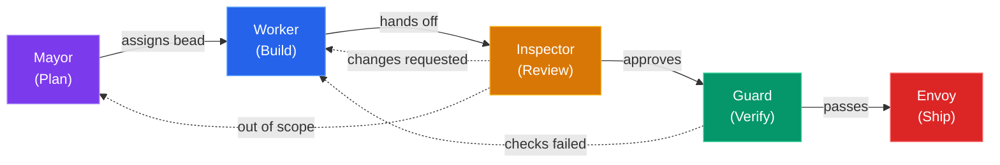

# OpenCode Village

## Orchestrating AI Agents for Software Development

Role-separated, bead-tracked, skill-driven AI workflow

<!-- Author placeholder — fill in before presenting -->
Your Name &bull; April 2026

<!--
Speaker notes:

Welcome everyone. Today I'll walk you through OpenCode Village —
a system that takes the "single autonomous AI" model and replaces it
with a team of specialised agents, each with clear responsibilities
and hard permission boundaries.
-->

---
layout: default
---

# The Problem

<h3 style="color: var(--vivid-orange); font-weight: 400; margin-bottom: 1.5em;">
What happens when one AI agent does everything?
</h3>

<v-clicks>

- **No separation of concerns** — the same agent edits code, runs tests, and pushes to production
- **No accountability** — when something breaks, there's no audit trail of *who* decided *what*
- **Context death** — session compaction erases memory; the AI forgets yesterday's decisions
- **Unchecked scope creep** — without guardrails, the agent "helpfully" rewrites your entire codebase
- **Trust is binary** — you either give it full access or none at all

</v-clicks>

<!--
Speaker notes:

If you've used Copilot, Cursor, or any AI coding assistant in a long session,
you know the feeling. It starts great, then context degrades, it loses track
of what it already did, and you end up babysitting it anyway.

The core issue: a single agent with full permissions and no memory is a recipe
for unpredictable behaviour. We need structure.
-->

---
layout: center
class: text-center
---

# What if your AI assistant had coworkers?

A team of specialists — each with a clear role, strict permissions, and a shared task board.

&#x1f3d8;

Welcome to the Village.

<!--
Speaker notes:

Instead of one omnipotent agent, imagine five:
one that plans, one that codes, one that reviews, one that tests, and one that ships.

Each has hard limits on what it can do. They communicate through a shared
issue tracker (beads), and hand off work to each other.

Let's see how that works.
-->

---
transition: slide-left
---

# The Village Model

Separation of concerns via permissions — just like a real team.

<!--
The key insight: each agent can only do what its role allows. Workers can't push, inspectors can't edit, guards can't write code. This creates natural checks and balances — just like a well-run engineering team.
-->

---
transition: slide-left
---

# Permission Matrix

What each agent **can** and **can't** do:

| Capability | Mayor | Worker | Inspector | Guard | Envoy |
|:-----------|:-----:|:------:|:---------:|:-----:|:-----:|
| Read code | ✅ | ✅ | ✅ | ✅ | ✅ |
| Edit files | ❌ | ✅ | ❌ | ❌ | ❌ |
| Local commits | ❌ | ✅ | ❌ | ❌ | ❌ |
| Run tests / lint | ❌ | ❌ | ❌ | ✅ | ❌ |
| Git push | ❌ | ❌ | ❌ | ❌ | ✅ |
| Create beads | ✅ | ❌ | ❌ | ❌ | ❌ |
| Open PRs | ❌ | ❌ | ❌ | ❌ | ✅ |

  Permissions are enforced by agent system prompts — not trust, but design.

<!--
This is the secret sauce of the village model. By constraining what each agent CAN do, we get reliable separation of concerns. The worker can't accidentally push broken code. The inspector can't "just fix it" and skip review. The guard must run the actual checks.
-->

---
transition: slide-left
---

# Mayor — The Planner

<v-clicks>

- **Researches** scope, asks clarifying questions, drafts the plan
- **Creates epics + child beads** — every task gets: Context, Skills, Branch, AC
- **Read-only** — never modifies files or runs commands
- **Beads are created immediately** — no waiting for approval gates
- **Sets the `## Skills`** section so workers load the right expertise

</v-clicks>

<Placeholder label="Screenshot: Mayor creating beads in OpenCode" height="240px" />

<code>/village:work</code> &rarr; mayor researches &rarr; <code>br create</code> &rarr; beads assigned to worker

<!--
Speaker notes:

The Mayor is your project manager. It takes a high-level goal ("add dark mode support")
and breaks it into concrete, implementable beads with clear acceptance criteria.

Key design choice: the Mayor CAN'T edit files. This prevents the planner from
"just doing it" and skipping the review pipeline. It must delegate.

Every bead the Mayor creates includes a Skills section — this tells the Worker
which domain skills to load (e.g. stack-typescript, stack-solana). This is how
the village stays polymorphic across tech stacks.
-->

---
transition: slide-left
---

# Worker — The Implementer

<v-clicks>

- **Implements exactly what the bead asks** — no more, no less
- **Claims work via `village_claim`** — single in-progress guard enforced
- **Commits locally** on `epic/*` branches — cannot push
- **Loads skills** from the bead's `## Skills` section before coding
- **Hands off to Inspector** when implementation is complete

</v-clicks>

<Placeholder label="Screenshot: Worker implementing a bead" height="240px" />

<code>village_claim</code> &rarr; implement &rarr; <code>git commit</code> &rarr; handoff to inspector

<!--
Speaker notes:

The Worker is the only agent that can edit files and make git commits.
But it can't push — that's the Envoy's job.

The single in-progress guard prevents the Worker from juggling multiple tasks.
It must finish (or get blocked on) one bead before claiming the next.

Skills are loaded dynamically: a Rails bead loads stack-ruby-on-rails,
a TypeScript bead loads stack-typescript. Same worker, different expertise.
This is the "polymorphic via skills" pattern.
-->

---
transition: slide-left
---

# Inspector — The Reviewer

<v-clicks>

- **Read-only code review** — cannot edit any files
- **Judgment checklist:** AC coverage, diff scope, regression sniff
- **Three verdicts:**
  - Approve &rarr; Guard
  - Changes requested &rarr; Worker
  - Out of scope &rarr; Mayor
- **Catches issues** before expensive CI runs
- **Writes review notes** as bead comments for traceability

</v-clicks>

<Placeholder label="Screenshot: Inspector reviewing a diff" height="240px" />

Approve &rarr; guard &nbsp;|&nbsp; Changes requested &rarr; worker &nbsp;|&nbsp; Out of scope &rarr; mayor

<!--
Speaker notes:

The Inspector is intentionally read-only. It can't "just fix" an issue —
it must send the bead back to the Worker with clear feedback.

This mirrors how human code review works: the reviewer doesn't commit to your branch.
They leave comments and you address them.

Why inspect before running tests? Because CI is expensive (time and compute).
Catching a misunderstood AC or a scope violation before tests run saves cycles.
The Inspector is the human-like judgment layer; the Guard is the mechanical one.
-->

---
transition: slide-left
---

# Guard — The Verifier

<v-clicks>

- **Runs the mechanical check matrix:** lint, typecheck, test, build
- **Polymorphic via stack skills** — same Guard, different checks per project
- **All green &rarr; closes the bead;** any red &rarr; returns to Worker
- **Cascade-closes** parent epic when all child beads pass
- **Reports the full matrix** — all checks run even if one fails early

</v-clicks>

<Placeholder label="Screenshot: Guard running check matrix" height="240px" />

<code>lint</code> &rarr; <code>typecheck</code> &rarr; <code>test</code> &rarr; <code>build</code> &rarr; all green? &rarr; <code>br close</code>

<!--
Speaker notes:

The Guard is pure automation — no judgment calls, no code changes.
It loads the same stack skill as the Worker (e.g. stack-typescript)
and runs every check in the matrix.

Key rule: run ALL checks even if one fails. This gives the Worker
a complete picture on the first bounce-back, instead of playing
whack-a-mole with one error at a time.

When the Guard closes the last child bead of an epic, it automatically
cascade-closes the parent. No human intervention needed.
-->

---
transition: slide-left
---

# Envoy — The Diplomat

<v-clicks>

- **Optional, human-triggered only** — invoked via `/village:envoy`
- **Pushes branches** and **opens GitHub PRs**
- **Cannot force push** or create non-`epic/*` branches
- **Minimal PR template:** What changed, Why, Closes `#issue`
- **Terminal step** — the only agent that touches the remote

</v-clicks>

<Placeholder label="Screenshot: PR created by Envoy" height="240px" />

Human triggers <code>/village:envoy</code> &rarr; push &rarr; <code>gh pr create</code> &rarr; done

<!--
Speaker notes:

The Envoy is deliberately the ONLY agent that can interact with the remote.
And it's human-triggered — it won't auto-ship code.

This is the trust boundary: everything up to the Envoy is local.
You can review all the commits, all the bead history, before deciding to ship.

The Envoy's PR template is intentionally minimal: What, Why, Closes.
No boilerplate, no checklist — that was already handled by the Inspector and Guard.

Think of the Envoy as the "merge button" abstracted into an agent.
It handles the mechanics of pushing and PR creation so you don't have to.
-->

---

<!-- Subsequent slides will be added by later beads -->
