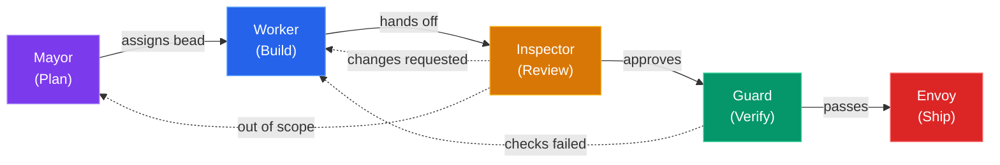

# OpenCode Village

## Orchestrating AI Agents for Software Development

Role-separated, bead-tracked, skill-driven AI workflow

<!-- Author placeholder — fill in before presenting -->
Your Name &bull; April 2026

<!--
Speaker notes:

Welcome everyone. Today I'll walk you through OpenCode Village —
a system that takes the "single autonomous AI" model and replaces it
with a team of specialised agents, each with clear responsibilities
and hard permission boundaries.
-->

---
layout: default
---

# The Problem

<h3 style="color: var(--vivid-orange); font-weight: 400; margin-bottom: 1.5em;">
What happens when one AI agent does everything?
</h3>

<v-clicks>

- **No separation of concerns** — the same agent edits code, runs tests, and pushes to production
- **No accountability** — when something breaks, there's no audit trail of *who* decided *what*
- **Context death** — session compaction erases memory; the AI forgets yesterday's decisions
- **Unchecked scope creep** — without guardrails, the agent "helpfully" rewrites your entire codebase
- **Trust is binary** — you either give it full access or none at all

</v-clicks>

<!--
Speaker notes:

If you've used Copilot, Cursor, or any AI coding assistant in a long session,
you know the feeling. It starts great, then context degrades, it loses track
of what it already did, and you end up babysitting it anyway.

The core issue: a single agent with full permissions and no memory is a recipe
for unpredictable behaviour. We need structure.
-->

---
layout: center
class: text-center
---

# What if your AI assistant had coworkers?

A team of specialists — each with a clear role, strict permissions, and a shared task board.

&#x1f3d8;

Welcome to the Village.

<!--
Speaker notes:

Instead of one omnipotent agent, imagine five:
one that plans, one that codes, one that reviews, one that tests, and one that ships.

Each has hard limits on what it can do. They communicate through a shared
issue tracker (beads), and hand off work to each other.

Let's see how that works.
-->

---
transition: slide-left
---

# The Village Model

Separation of concerns via permissions — just like a real team.

<!--
The key insight: each agent can only do what its role allows. Workers can't push, inspectors can't edit, guards can't write code. This creates natural checks and balances — just like a well-run engineering team.
-->

---
transition: slide-left
---

# Permission Matrix

What each agent **can** and **can't** do:

| Capability | Mayor | Worker | Inspector | Guard | Envoy |
|:-----------|:-----:|:------:|:---------:|:-----:|:-----:|
| Read code | ✅ | ✅ | ✅ | ✅ | ✅ |
| Edit files | ❌ | ✅ | ❌ | ❌ | ❌ |
| Local commits | ❌ | ✅ | ❌ | ❌ | ❌ |
| Run tests / lint | ❌ | ❌ | ❌ | ✅ | ❌ |
| Git push | ❌ | ❌ | ❌ | ❌ | ✅ |
| Create beads | ✅ | ❌ | ❌ | ❌ | ❌ |
| Open PRs | ❌ | ❌ | ❌ | ❌ | ✅ |

  Permissions are enforced by agent system prompts — not trust, but design.

<!--
This is the secret sauce of the village model. By constraining what each agent CAN do, we get reliable separation of concerns. The worker can't accidentally push broken code. The inspector can't "just fix it" and skip review. The guard must run the actual checks.
-->

---

<!-- Subsequent slides will be added by later beads -->
