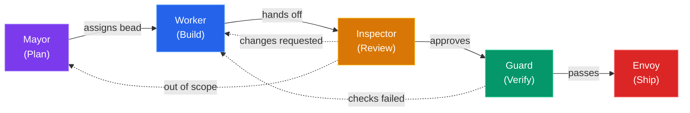
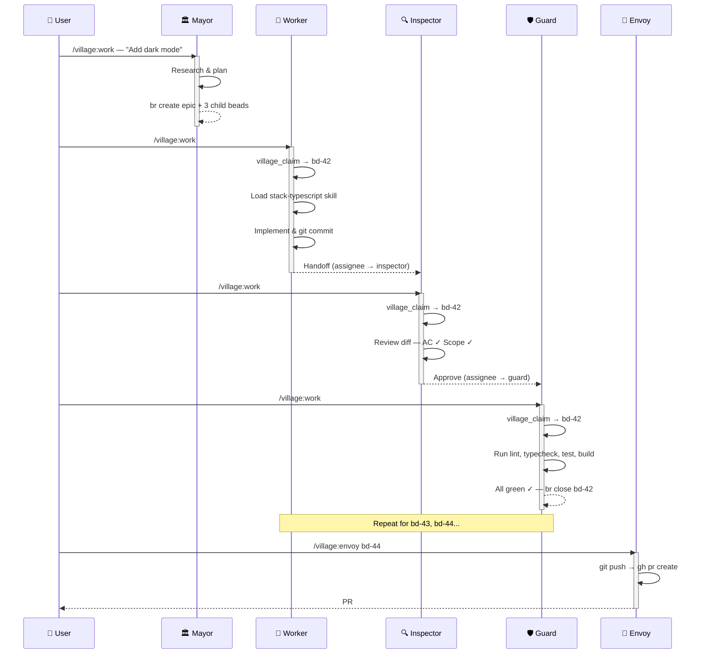

# OpenCode Village

## Orchestrating AI Agents for Software Development

<div class="mt-8 text-lg" style="color: var(--vivid-muted)">
Role-separated, bead-tracked, skill-driven AI workflow
</div>

<div class="abs-bl m-6 text-sm" style="color: var(--vivid-comment)">
<!-- Author placeholder — fill in before presenting -->
Your Name &bull; April 2026
</div>

<!--
Speaker notes:

Welcome everyone. Today I'll walk you through OpenCode Village —
a system that takes the "single autonomous AI" model and replaces it
with a team of specialised agents, each with clear responsibilities
and hard permission boundaries.
-->

---
layout: default
---

# The Problem

<h3 style="color: var(--vivid-orange); font-weight: 400; margin-bottom: 1.5em;">
What happens when one AI agent does everything?
</h3>

<v-clicks>

- **No separation of concerns** — the same agent edits code, runs tests, and pushes to production
- **No accountability** — when something breaks, there's no audit trail of *who* decided *what*
- **Context death** — session compaction erases memory; the AI forgets yesterday's decisions
- **Unchecked scope creep** — without guardrails, the agent "helpfully" rewrites your entire codebase
- **Trust is binary** — you either give it full access or none at all

</v-clicks>

<!--
Speaker notes:

If you've used Copilot, Cursor, or any AI coding assistant in a long session,
you know the feeling. It starts great, then context degrades, it loses track
of what it already did, and you end up babysitting it anyway.

The core issue: a single agent with full permissions and no memory is a recipe
for unpredictable behaviour. We need structure.
-->

---
layout: center
class: text-center
---

# What if your AI assistant had coworkers?

<div class="mt-6 text-xl" style="color: var(--vivid-purple)">
A team of specialists — each with a clear role, strict permissions, and a shared task board.
</div>

<div class="mt-12 text-6xl">
<span style="color: var(--vivid-cyan)">&#x1f3d8;</span>
</div>

<div class="mt-4 text-lg" style="color: var(--vivid-muted)">
Welcome to the Village.
</div>

<!--
Speaker notes:

Instead of one omnipotent agent, imagine five:
one that plans, one that codes, one that reviews, one that tests, and one that ships.

Each has hard limits on what it can do. They communicate through a shared
issue tracker (beads), and hand off work to each other.

Let's see how that works.
-->

---
transition: slide-left
---

# The Village Model

Separation of concerns via permissions — just like a real team.



<!--
The key insight: each agent can only do what its role allows. Workers can't push, inspectors can't edit, guards can't write code. This creates natural checks and balances — just like a well-run engineering team.
-->

---
transition: slide-left
---

# Permission Matrix

What each agent **can** and **can't** do:

<div class="mt-4">

| Capability | <span style="color: var(--vivid-purple)">Mayor</span> | <span style="color: var(--vivid-blue)">Worker</span> | <span style="color: var(--vivid-orange)">Inspector</span> | <span style="color: var(--vivid-green)">Guard</span> | <span style="color: var(--vivid-red)">Envoy</span> |
|:-----------|:-----:|:------:|:---------:|:-----:|:-----:|
| Read code | ✅ | ✅ | ✅ | ✅ | ✅ |
| Edit files | ❌ | ✅ | ❌ | ❌ | ❌ |
| Local commits | ❌ | ✅ | ❌ | ❌ | ❌ |
| Run tests / lint | ❌ | ❌ | ❌ | ✅ | ❌ |
| Git push | ❌ | ❌ | ❌ | ❌ | ✅ |
| Create beads | ✅ | ❌ | ❌ | ❌ | ❌ |
| Open PRs | ❌ | ❌ | ❌ | ❌ | ✅ |

</div>

<div class="mt-6 text-sm" style="color: var(--vivid-muted)">
  Permissions are enforced by agent system prompts — not trust, but design.
</div>

<!--
This is the secret sauce of the village model. By constraining what each agent CAN do, we get reliable separation of concerns. The worker can't accidentally push broken code. The inspector can't "just fix it" and skip review. The guard must run the actual checks.
-->

---
transition: slide-left
---

# <span style="color: var(--vivid-purple)">Mayor</span> — The Planner

<div class="grid grid-cols-[1fr_1fr] gap-6">
<div>

<v-clicks>

- **Researches** scope, asks clarifying questions, drafts the plan
- **Creates epics + child beads** — every task gets: Context, Skills, Branch, AC
- **Read-only** — never modifies files or runs commands
- **Beads are created immediately** — no waiting for approval gates
- **Sets the `## Skills`** section so workers load the right expertise

</v-clicks>

</div>
<div>

<Placeholder label="Screenshot: Mayor creating beads in OpenCode" height="240px" />

</div>
</div>

<div class="mt-4 text-sm" style="color: var(--vivid-muted)">
<code>/village:work</code> &rarr; mayor researches &rarr; <code>br create</code> &rarr; beads assigned to worker
</div>

<!--
Speaker notes:

The Mayor is your project manager. It takes a high-level goal ("add dark mode support")
and breaks it into concrete, implementable beads with clear acceptance criteria.

Key design choice: the Mayor CAN'T edit files. This prevents the planner from
"just doing it" and skipping the review pipeline. It must delegate.

Every bead the Mayor creates includes a Skills section — this tells the Worker
which domain skills to load (e.g. stack-typescript, stack-solana). This is how
the village stays polymorphic across tech stacks.
-->

---
transition: slide-left
---

# <span style="color: var(--vivid-blue)">Worker</span> — The Implementer

<div class="grid grid-cols-[1fr_1fr] gap-6">
<div>

<v-clicks>

- **Implements exactly what the bead asks** — no more, no less
- **Claims work via `village_claim`** — single in-progress guard enforced
- **Commits locally** on `epic/*` branches — cannot push
- **Loads skills** from the bead's `## Skills` section before coding
- **Hands off to Inspector** when implementation is complete

</v-clicks>

</div>
<div>

<Placeholder label="Screenshot: Worker implementing a bead" height="240px" />

</div>
</div>

<div class="mt-4 text-sm" style="color: var(--vivid-muted)">
<code>village_claim</code> &rarr; implement &rarr; <code>git commit</code> &rarr; handoff to inspector
</div>

<!--
Speaker notes:

The Worker is the only agent that can edit files and make git commits.
But it can't push — that's the Envoy's job.

The single in-progress guard prevents the Worker from juggling multiple tasks.
It must finish (or get blocked on) one bead before claiming the next.

Skills are loaded dynamically: a Rails bead loads stack-ruby-on-rails,
a TypeScript bead loads stack-typescript. Same worker, different expertise.
This is the "polymorphic via skills" pattern.
-->

---
transition: slide-left
---

# <span style="color: var(--vivid-orange)">Inspector</span> — The Reviewer

<div class="grid grid-cols-[1fr_1fr] gap-6">
<div>

<v-clicks>

- **Read-only code review** — cannot edit any files
- **Judgment checklist:** AC coverage, diff scope, regression sniff
- **Three verdicts:**
  - Approve &rarr; Guard
  - Changes requested &rarr; Worker
  - Out of scope &rarr; Mayor
- **Catches issues** before expensive CI runs
- **Writes review notes** as bead comments for traceability

</v-clicks>

</div>
<div>

<Placeholder label="Screenshot: Inspector reviewing a diff" height="240px" />

</div>
</div>

<div class="mt-4 text-sm" style="color: var(--vivid-muted)">
Approve &rarr; guard &nbsp;|&nbsp; Changes requested &rarr; worker &nbsp;|&nbsp; Out of scope &rarr; mayor
</div>

<!--
Speaker notes:

The Inspector is intentionally read-only. It can't "just fix" an issue —
it must send the bead back to the Worker with clear feedback.

This mirrors how human code review works: the reviewer doesn't commit to your branch.
They leave comments and you address them.

Why inspect before running tests? Because CI is expensive (time and compute).
Catching a misunderstood AC or a scope violation before tests run saves cycles.
The Inspector is the human-like judgment layer; the Guard is the mechanical one.
-->

---
transition: slide-left
---

# <span style="color: var(--vivid-green)">Guard</span> — The Verifier

<div class="grid grid-cols-[1fr_1fr] gap-6">
<div>

<v-clicks>

- **Runs the mechanical check matrix:** lint, typecheck, test, build
- **Polymorphic via stack skills** — same Guard, different checks per project
- **All green &rarr; closes the bead;** any red &rarr; returns to Worker
- **Cascade-closes** parent epic when all child beads pass
- **Reports the full matrix** — all checks run even if one fails early

</v-clicks>

</div>
<div>

<Placeholder label="Screenshot: Guard running check matrix" height="240px" />

</div>
</div>

<div class="mt-4 text-sm" style="color: var(--vivid-muted)">
<code>lint</code> &rarr; <code>typecheck</code> &rarr; <code>test</code> &rarr; <code>build</code> &rarr; all green? &rarr; <code>br close</code>
</div>

<!--
Speaker notes:

The Guard is pure automation — no judgment calls, no code changes.
It loads the same stack skill as the Worker (e.g. stack-typescript)
and runs every check in the matrix.

Key rule: run ALL checks even if one fails. This gives the Worker
a complete picture on the first bounce-back, instead of playing
whack-a-mole with one error at a time.

When the Guard closes the last child bead of an epic, it automatically
cascade-closes the parent. No human intervention needed.
-->

---
transition: slide-left
---

# <span style="color: var(--vivid-red)">Envoy</span> — The Diplomat

<div class="grid grid-cols-[1fr_1fr] gap-6">
<div>

<v-clicks>

- **Optional, human-triggered only** — invoked via `/village:envoy`
- **Pushes branches** and **opens GitHub PRs**
- **Cannot force push** or create non-`epic/*` branches
- **Minimal PR template:** What changed, Why, Closes `#issue`
- **Terminal step** — the only agent that touches the remote

</v-clicks>

</div>
<div>

<Placeholder label="Screenshot: PR created by Envoy" height="240px" />

</div>
</div>

<div class="mt-4 text-sm" style="color: var(--vivid-muted)">
Human triggers <code>/village:envoy</code> &rarr; push &rarr; <code>gh pr create</code> &rarr; done
</div>

<!--
Speaker notes:

The Envoy is deliberately the ONLY agent that can interact with the remote.
And it's human-triggered — it won't auto-ship code.

This is the trust boundary: everything up to the Envoy is local.
You can review all the commits, all the bead history, before deciding to ship.

The Envoy's PR template is intentionally minimal: What, Why, Closes.
No boilerplate, no checklist — that was already handled by the Inspector and Guard.

Think of the Envoy as the "merge button" abstracted into an agent.
It handles the mechanics of pushing and PR creation so you don't have to.
-->

---
transition: slide-left
---

# What Are <span style="color: var(--vivid-green)">Beads</span>?

<div class="grid grid-cols-[1fr_1fr] gap-6">
<div>

<v-clicks>

- **Git-native, AI-first issue tracker** — issues live inside the repo in `.beads/`
- **SQLite locally**, synced to JSONL for git versioning — no external API needed
- **Issue types:** task, bug, feature, epic, chore, decision, question, docs
- **Priority levels:** P0 (critical) &rarr; P4 (backlog)
- **Rich dependencies:** blocks, parent-child, discovered-from
- **Issues travel with the code** — clone the repo, get the full project history

</v-clicks>

</div>
<div>

```bash
# Create a task
br create --title="Add auth middleware" \
  --type=task --priority=2

# See what's ready to work on
br ready

# Show details
br show bd-42

# Close when done
br close bd-42 --reason="Implemented"
```

</div>
</div>

<div class="mt-4 text-sm" style="color: var(--vivid-muted)">
<code>.beads/</code> &rarr; SQLite + JSONL &rarr; <code>git add .beads/ && git commit</code> &rarr; issues travel with every clone
</div>

<!--
Speaker notes:

Beads is the backbone of the village. Without it, agents have no shared
task list — they'd need an external tool like Jira or Linear.

The key insight: issues should live WHERE the code lives. When you clone
a repo, you get the issues. When you branch, you can branch the issues.
When you merge, the issues merge.

SQLite gives you fast local queries. JSONL gives you git-friendly diffs.
br sync --flush-only exports SQLite to JSONL so git can track changes.

The dependency system is crucial for the village: blocks relationships
let br ready show only unblocked work, so agents don't waste time on
tasks that can't be started yet.
-->

---
transition: slide-left
---

# <span style="color: var(--vivid-cyan)">Context Preservation</span> — br prime

<div class="grid grid-cols-[1fr_1fr] gap-6">
<div>

<v-clicks>

- **The problem:** AI sessions have limited context windows — *compaction kills memory*
- **`br prime`** outputs an AI-optimised summary of all beads state
- **Auto-injected** by the opencode-beads-rust plugin on session start **and** after compaction
- **This is the "memory"** that ties agents across sessions together
- **Discovery chains:** agent finds bug while working on feature &rarr; links with `discovered-from` &rarr; future agents see the full context

</v-clicks>

</div>
<div>

```bash
# What br prime outputs:
$ br prime

# ── Active Beads ──
# bd-139 [epic] P1 open
#   Build OpenCode Village Presentation
#
# bd-139.5 [task] P1 in_progress
#   Beads + Context Preservation slides
#   blocked-by: bd-139.4 (closed ✓)
#   blocks: bd-139.6
#
# ── Summary ──
# 3 open | 4 closed | 1 in_progress
```

</div>
</div>

<div class="mt-4 text-sm" style="color: var(--vivid-muted)">
Session starts &rarr; <code>br prime</code> auto-injected &rarr; agent has full project memory &rarr; compaction happens &rarr; <code>br prime</code> re-injected
</div>

<!--
Speaker notes:

This is arguably the most important slide. It answers the question:
"How do different AI sessions share knowledge?"

Without br prime, every new session starts from zero. The agent has to
re-discover what's been done, what's blocked, what's in progress.

With br prime, the first thing the agent sees is a structured summary
of all beads — priorities, statuses, dependencies, and discovery chains.

The discovery chain feature is especially powerful. Say a Worker is
implementing a feature and discovers a bug. It creates a new bead with
discovered-from linking back to the original feature bead. When a future
agent runs br prime, it sees that relationship and understands WHY
that bug bead exists.

The plugin handles injection automatically — you don't need to remember
to run br prime manually. It just works.
-->

---
transition: slide-left
---

# <span style="color: var(--vivid-green)">beads_viewer</span> (bv) — Interactive TUI

<div class="grid grid-cols-[1fr_1fr] gap-6">
<div>

<v-clicks>

- **Terminal UI** for browsing issues interactively
- **Board view** — see all issues by status at a glance
- **Dependency graph** — visualise which issues block which
- **Agents use `br` CLI** with `--json` for structured data
- **Humans use `bv`** for visual exploration and triage
- **Same data, different interface** — SQLite underneath both

</v-clicks>

</div>
<div>

<Placeholder label="Screenshot: beads_viewer board with issues by status" height="160px" />

<Placeholder label="Screenshot: beads_viewer dependency graph" height="160px" />

</div>
</div>

<div class="mt-4 text-sm" style="color: var(--vivid-muted)">
Agents: <code>br show bd-42 --json</code> &nbsp;|&nbsp; Humans: <code>bv</code> &rarr; interactive board &amp; graph
</div>

<!--
Speaker notes:

beads_viewer is the human-friendly interface to the same data.
While agents interact with beads through the br CLI (especially with --json
for structured output), humans get a full terminal UI.

The board view shows issues grouped by status — open, in_progress, blocked,
closed. You can filter by type, priority, or assignee.

The dependency graph is particularly useful for epics: you can see at a
glance which tasks are done, which are in progress, and which are still
blocked waiting for their dependencies.

The key insight: agents and humans work with the same underlying data.
There's no sync problem, no "source of truth" debate. It's all in .beads/,
versioned in git.
-->

---
transition: slide-left
---

# <span style="color: var(--vivid-yellow)">Slash Commands</span>

<div class="grid grid-cols-[1fr_1fr] gap-6">
<div>

<v-clicks>

- **`/village:work`** — The main loop: claim bead &rarr; load skills &rarr; implement &rarr; handoff &rarr; repeat
- **`/village:board`** — ASCII board of current village state: who has what bead, what status
- **`/village:orphans [fix]`** — Find unassigned beads; pass `fix` to auto-assign them
- **`/village:envoy <id>`** — Dispatch the Envoy to push branch and open a GitHub PR

</v-clicks>

</div>
<div>

```bash
# Start the work loop (as any role)
/village:work

# See the board at a glance
/village:board
# ┌─────────┬──────────┬──────────┐
# │  open   │ progress │  closed  │
# ├─────────┼──────────┼──────────┤
# │ bd-42   │ bd-41    │ bd-40 ✓  │
# │ bd-43   │          │ bd-39 ✓  │
# └─────────┴──────────┴──────────┘

# Find & fix orphaned beads
/village:orphans fix

# Ship it
/village:envoy bd-41
```

</div>
</div>

<div class="mt-4 text-sm" style="color: var(--vivid-muted)">
Four commands. Each role runs <code>/village:work</code> — the command adapts to the agent's permissions.
</div>

<!--
Speaker notes:

There are only four slash commands to learn. That's it.

/village:work is the workhorse — it's the same command for every role.
When the Mayor runs it, it plans. When the Worker runs it, it implements.
When the Guard runs it, it runs checks. The command adapts to the agent's
permission set.

/village:board gives you a quick overview without leaving your terminal.
It's like a mini kanban board showing who has what.

/village:orphans is a housekeeping command. Sometimes beads get created
but not assigned — this finds them and optionally fixes the assignment.

/village:envoy is the human-triggered shipping step. You decide when
to push. The Envoy handles the mechanics.
-->

---
transition: slide-left
---

# <span style="color: var(--vivid-cyan)">Workflow Walkthrough</span> — Idea to PR



<div class="mt-2 text-sm" style="color: var(--vivid-muted)">
One idea &rarr; structured beads &rarr; implemented &rarr; reviewed &rarr; verified &rarr; shipped. No step skipped.
</div>

<!--
Speaker notes:

This is the complete lifecycle. Let's walk through it:

Step 1: The user tells the Mayor "Add dark mode". The Mayor researches
the codebase, creates an epic bead with three child task beads, each
with acceptance criteria and skill requirements.

Step 2: The user switches to the Worker agent and runs /village:work.
The Worker claims the first unblocked bead via village_claim, loads
the stack-typescript skill (because the bead says so), implements the
change, commits locally, and hands off to the Inspector.

Step 3: The Inspector does a read-only code review. It checks acceptance
criteria coverage, diff scope, and sniffs for regressions. If everything
looks good, it approves and hands off to the Guard.

Step 4: The Guard runs the full check matrix — lint, typecheck, tests,
build. If everything passes, it closes the bead. If something fails,
it sends the bead back to the Worker with the full error output.

Steps 2-4 repeat for each child bead in the epic.

Step 5: When all beads are closed, the user triggers the Envoy to push
the branch and create a PR. This is the only step that touches the remote.

The key insight: at no point does a single agent handle the entire lifecycle.
Each step is handled by a specialist with specific permissions.
-->

---
transition: slide-left
---

# Success: <span style="color: var(--vivid-green)">Vibecoding Go</span> Without Knowing Go

<div class="grid grid-cols-4 gap-4 my-6 text-center">
<div style="border: 1px solid var(--vivid-green); border-radius: 12px; padding: 1.2em 0.5em;">
<div style="font-size: 2.4em; font-weight: 800; color: var(--vivid-green); line-height: 1;">22</div>
<div style="color: var(--vivid-muted); font-size: 0.85em; margin-top: 0.3em;">Merged PRs</div>
</div>
<div style="border: 1px solid var(--vivid-blue); border-radius: 12px; padding: 1.2em 0.5em;">
<div style="font-size: 2.4em; font-weight: 800; color: var(--vivid-blue); line-height: 1;">3</div>
<div style="color: var(--vivid-muted); font-size: 0.85em; margin-top: 0.3em;">Go Repositories</div>
</div>
<div style="border: 1px solid var(--vivid-orange); border-radius: 12px; padding: 1.2em 0.5em;">
<div style="font-size: 2.4em; font-weight: 800; color: var(--vivid-orange); line-height: 1;">~4</div>
<div style="color: var(--vivid-muted); font-size: 0.85em; margin-top: 0.3em;">Weeks</div>
</div>
<div style="border: 1px solid var(--vivid-red); border-radius: 12px; padding: 1.2em 0.5em;">
<div style="font-size: 2.4em; font-weight: 800; color: var(--vivid-red); line-height: 1;">0</div>
<div style="color: var(--vivid-muted); font-size: 0.85em; margin-top: 0.3em;">Prior Go Knowledge</div>
</div>
</div>

<h3 style="color: var(--vivid-purple); font-weight: 400; margin-bottom: 0.8em;">
"Omni in Slack" — AI assistant integration across 3 Go services
</h3>

<v-clicks>

- **Streaming AI delivery pipeline** — real-time token streaming to Slack
- **Slack Block Kit conversion** from protobuf — rich message formatting
- **Citation resolver** — deep links back into the Outreach application
- **Multi-org switching** with Slack modals — cross-tenant UX
- **Identity store race condition** fixes — concurrency bugs in production
- **Full rebrand** — Ask Outreach &rarr; Omni across all services

</v-clicks>

<!--
Speaker notes:

This is the proof it works. Let the numbers sink in first.

22 merged PRs across 3 Go repositories in about 4 weeks — with zero
prior Go knowledge. Not "some Go" — literally none.

The feature being built was "Omni in Slack" — an AI assistant that
integrates into Slack for Outreach customers. It involved streaming
AI responses in real-time, converting protobuf messages to Slack's
Block Kit format, resolving citations as deep links, and handling
multi-org Slack workspaces.

The work wasn't trivial. It included fixing race conditions in an
identity store — the kind of concurrency bug that trips up experienced
Go developers. The village model made this possible because the AI
knows Go idioms even if the developer doesn't.

And the full rebrand (Ask Outreach → Omni) touched every service,
every string, every API endpoint. The kind of tedious multi-file
rename that's perfect for an AI agent with a structured task list.
-->

---
transition: slide-left
---

# Why the <span style="color: var(--vivid-cyan)">Village</span> Helped

<div class="grid grid-cols-[1fr_1fr] gap-6">
<div>

<v-clicks>

- <span style="color: var(--vivid-purple)">**Mayor**</span> decomposed a complex multi-repo epic into small, reviewable beads
- <span style="color: var(--vivid-blue)">**Worker**</span> handled Go idioms — the AI knows Go even if *you* don't
- <span style="color: var(--vivid-orange)">**Inspector**</span> caught scope creep and regressions before CI
- <span style="color: var(--vivid-green)">**Guard**</span> ran all Go tests (*860+ per package*) mechanically
- **Structured handoffs** prevented "yolo shipping" to production
- <span style="color: var(--vivid-cyan)">**Beads**</span> preserved context across dozens of sessions

</v-clicks>

</div>
<div>

<Placeholder label="Screenshot: GitHub PR list showing merged Go PRs" height="280px" />

</div>
</div>

<div class="mt-4 text-sm" style="color: var(--vivid-muted)">
No single agent could have done this. Each role contributed its speciality to a language the developer had never written.
</div>

<!--
Speaker notes:

This slide maps the success directly back to the village model.

The Mayor turned a vague requirement ("integrate Omni into Slack") into
structured beads with clear acceptance criteria. Without this, the Worker
would have been wandering.

The Worker wrote Go code using the AI's built-in knowledge of Go idioms,
error handling patterns, goroutine safety. The developer just needed to
describe WHAT they wanted — the Worker knew HOW to express it in Go.

The Inspector was critical for a language the developer didn't know.
It caught non-idiomatic patterns, potential nil pointer dereferences,
and scope creep where the Worker tried to "improve" existing code.

The Guard ran 860+ tests per package. Every single time. Mechanically.
No "I'll skip the slow tests this time." This is where bugs in concurrent
code were caught — tests that the developer might not have run locally.

The structured handoffs meant nothing went to production without passing
through Inspector AND Guard. In a language you don't know, this safety
net is everything.

And beads preserved context across dozens of sessions over 4 weeks.
Every session started with br prime knowing exactly what was done,
what was next, and what was blocked. No re-explaining, no "where were we?"
-->

---
transition: slide-left
---

# <span style="color: var(--vivid-orange)">Drawbacks</span> & Honest Takes

<div class="grid grid-cols-3 gap-5 my-4">
<div style="border: 1px solid var(--vivid-red); border-radius: 12px; padding: 1em;">
<div style="font-size: 1.1em; font-weight: 700; color: var(--vivid-red); margin-bottom: 0.5em;">Token Usage</div>
<div style="font-size: 2em; font-weight: 800; color: var(--vivid-red); line-height: 1;">3–5x</div>
<div style="color: var(--vivid-muted); font-size: 0.8em; margin-top: 0.3em;">more tokens than single-agent</div>

<v-clicks>

- Multiple context windows (one per role)
- Handoffs reload beads, skills, diff
- Inspector + guard burn tokens on "obvious" code

</v-clicks>

</div>
<div style="border: 1px solid var(--vivid-orange); border-radius: 12px; padding: 1em;">
<div style="font-size: 1.1em; font-weight: 700; color: var(--vivid-orange); margin-bottom: 0.5em;">Speed</div>
<div style="font-size: 2em; font-weight: 800; color: var(--vivid-orange); line-height: 1;">10–15 min</div>
<div style="color: var(--vivid-muted); font-size: 0.8em; margin-top: 0.3em;">per bead (vs 2–5 min single-agent)</div>

<v-clicks>

- Sequential pipeline is inherently slower
- Worker &rarr; Inspector &rarr; Guard = 3 sessions
- Speed scales with number of beads

</v-clicks>

</div>
<div style="border: 1px solid var(--vivid-green); border-radius: 12px; padding: 1em;">
<div style="font-size: 1.1em; font-weight: 700; color: var(--vivid-green); margin-bottom: 0.5em;">The Tradeoff</div>
<div style="font-size: 1.4em; font-weight: 700; color: var(--vivid-green); line-height: 1.2; margin-top: 0.2em;">Quality vs Speed</div>
<div style="color: var(--vivid-muted); font-size: 0.8em; margin-top: 0.3em;">a conscious choice, not a bug</div>

<v-clicks>

- Worth it for complex, multi-repo work
- Overkill for one-liner fixes
- Configurable — skip inspector/guard when trivial

</v-clicks>

</div>
</div>

<div class="mt-2 text-sm" style="color: var(--vivid-muted)">
Honest cost: more tokens, slower pipeline. Honest benefit: fewer production incidents, full audit trail, language-agnostic safety net.
</div>

<!--
Speaker notes:

This is the honesty slide. I put it here deliberately — right after the
success story — because credibility comes from acknowledging the costs.

Token usage: the village burns roughly 3-5x the tokens of a single agent
for the same output. Every handoff reloads context: beads state, skill
instructions, the relevant diff. Inspector and guard sessions add cost
even when the code is straightforward.

Speed: a single bead takes 10-15 minutes through the full pipeline.
Worker implements (3-5 min), Inspector reviews (2-3 min), Guard runs
checks (3-5 min). A single agent could do all three in 2-5 minutes —
but without the quality assurance.

The tradeoff is conscious. For complex features — like the Go work
we just talked about — the safety net is absolutely worth it. For a
one-liner typo fix, it's overkill. The workflow is configurable:
you can skip Inspector and Guard for trivial changes.

Frame this as "right tool for the job" — not every task needs the
full pipeline.
-->

---

<!-- Subsequent slides will be added by later beads -->
